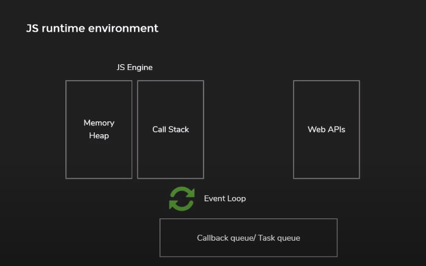
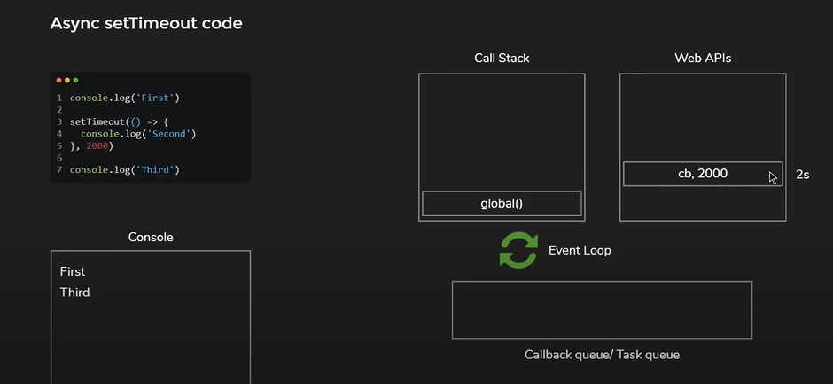

# Topics to be covered

1. Recap about async programming, different parts essetial to run async code, synchronous code snippet
2. How setTimeout works
3. How Promise works
4. Combination of the above

### Javascript is Synchronous, blocking, single threaded language

### To make async programming possible, JavaScript alone isn't enough we also need web browsers

##### What are the parts which comes together from Javascript and web browser and make async programming possible

> The entire model is reffered to as Javascript runtime environment. As part of this runtime we have following component

1. Js engine(Memory heap+ call stack) eg: v8 engine

   1. whenever you declare variables and function, memory allocated on heap
   2. whenever you execute a functions are pushed on to the call stack and whenever functions are returned they are poped off the
      the call stack. A straught in last in first out implementation of stack data structure

2. web browsers apis eg: setTimeout, setInterval, promise, DOM, fetch etc...... Note these apis are not implemented in JS.
   These are feeatures provided by browser which Javascripe can use to pass in a callback function

3. callback queuqe/ Task queue/ message queue: This queue is first in first out data structure.

4. Event loop: Event loop has only one job, check if call stack if empty and if it is the push the first item from callback queue
   into the call stack



### Execution of a Timeout

## 

---

#### when the time associated with the callback function expires the callback function is not directly pused onto the call stack, it would lead to chaos. Rather the callback function is pushed into the callback queue and when the call stack is empty the event loop will push the callback function into the callstack where the function is executed.

**Function of Event loop**: check callstack, check callback queue and if callstack is empty, push a callback function from queue in the callstack

## How Promise works?

```js

console.log('First');
cosnt promise=fetch('https://api.example.com/data')
promise.then(response => response.json())
    .then(data => {
        // Handle the data
        console.log(data);
    })
    .catch(error => {
        // Handle any errors
        console.error(error);
    });
console.log('Second');

```

**Now, let's dive into the event loop and callback queue:**

1. _When the JavaScript engine encounters an asynchronous operation (such as the fetch request), it offloads that operation to the browser's Web API environment (or Node.js environment in the case of server-side JavaScript)._
2. Once the asynchronous operation completes (in this case, when the network request finishes), a task (or microtask, depending on the operation) is queued in the callback queue.
3. The event loop constantly checks if the call stack is empty. If it is, it looks into the callback queue for tasks to move into the call stack for execution.
4. In this scenario, when the fetch request completes, the callback function attached to the promise (.then()) is queued into the callback queue.
5. Since there is no other code to execute after console.log('Second'), the call stack is empty, and the event loop moves the callback function from the queue to the call stack.
6. The callback function then executes, parsing the response as JSON and logging it to the console.
7. If there were any errors during the fetch or JSON parsing process, the .catch() block would handle them. Any errors encountered would also be queued into the callback queue and processed similarly.
